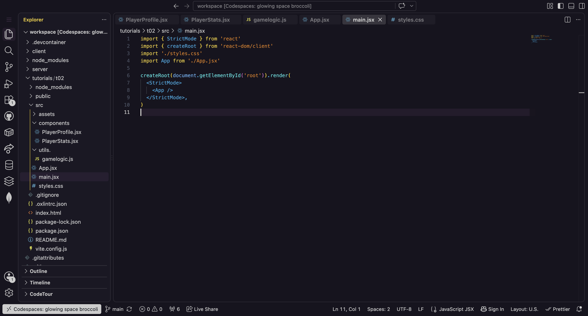
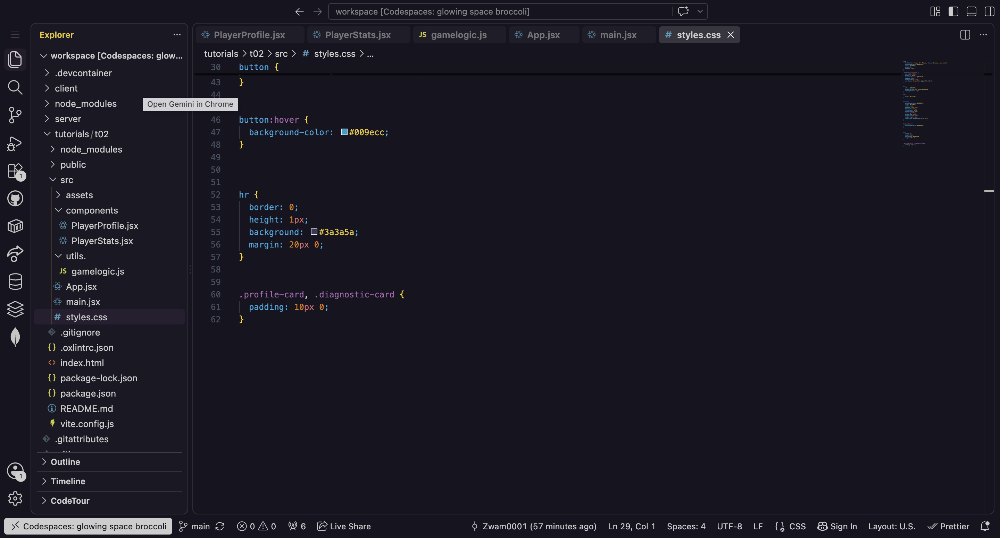
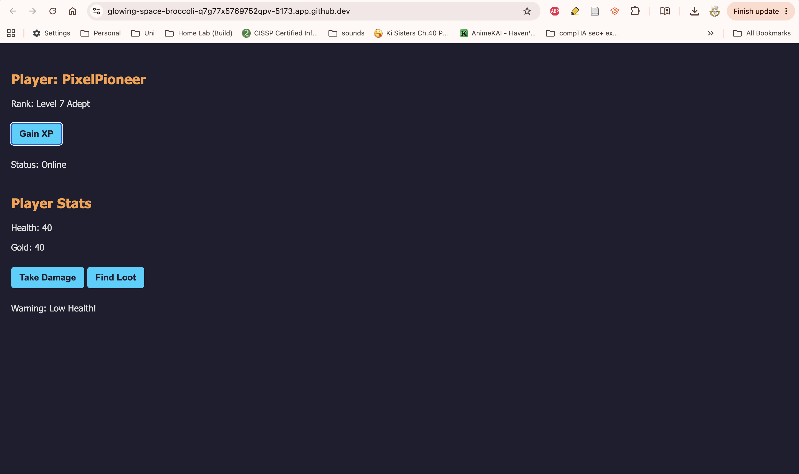
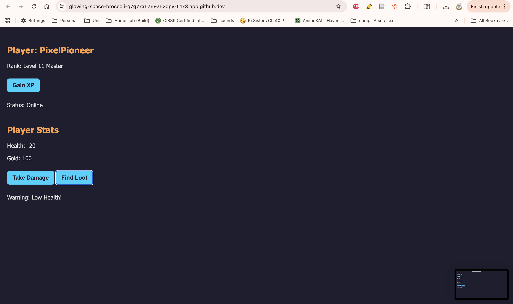
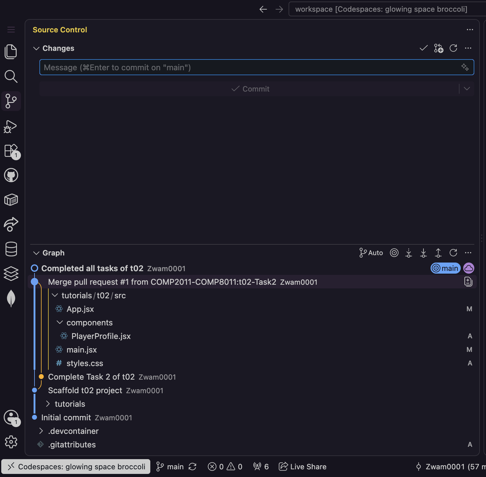

<!-- 
Basic markdown tags
Single Asterisk * before and after text will make that text italic
Double Asterisk ** before and after text will make that text bold
# Heading 1
## Heading 2
- at the start of a line creates a dot point list item
1. at the start of a line creates a numbered list item
A vertical bar | defines the start of a table cell, use another vertical bar | to close off the table cell
Backticks ` around text will format that text as code
To insert an image: 
   
where Image Alt Text should be the desciption of that image for people with low/no vision, and ./path/URL/to/image, is the relative path in your folders to get to the image
-->
# Module 02 Devlog

## Proof of Completion

**Background:** Today's tutorial project was to create a ...


(PlayerProfile.jsx)
*Description: This image depicts...*


(PlayerStats.jsx)
*Description: This image depicts...*


(gamelogic.js)
*Description: This image depicts...*


(App.jsx)
*Description: This image depicts...*



(main.jsx)
*Description: This image depicts...*



(styles.css)
*Description: This image depicts...*


(Output functionality 1)
*Description: This image depicts...*



(Output functionality 2)
*Description: This image depicts...*



(Output functionality 3)
*Description: This image depicts...*



(Version Control History)
*Description: This image depicts...*

**Extension task completed successfully:** [Yes / No]
<!-- Delete either option based on your work completed -->

*Question: what is the extension task?*


## Concept Mapping

Identify the specific theoretical concepts from this week’s lectures that you applied to solve the practical work for this week.

- **Concept 1: Creating a custom JSX component** [Lecture slide number: 21] — To create a custom JSX component you must define ***isolated*** (won't break part of application) ***reusable*** (can be placed on many different pages) interface elements ***pragmatically*** (through the application of coding logic and programming rules). 
  - **Implementation:** 
    
*(Code snippet)*

```
import { useState } from 'react';
import { getPlayerRank } from '../utils./gamelogic.js';

function PlayerProfile() {

//const player = { username: "PixelPioneer", level: 5, active: true };
const [player, setPlayer] = useState({
    username: "PixelPioneer",
    level: 5,
    active: true
});
const { username, level, active } = player;

const handleLevelUp = () => {
    const updatedPlayer = { ...player, level: level + 1 };
    //console.log(“Updated player state: “, updatedPlayer);
    setPlayer(updatedPlayer);

};

return (
    <>
         <div className="profile-card">
             <h2>Player: {username}</h2>
             <p>Rank: {getPlayerRank(level)}</p>
             <button onClick={handleLevelUp}>Gain XP</button>
             {active ? <p>Status: Online</p> : <p>Status: Offline</p>}

         </div>
    </>
);
}

export default PlayerProfile;
```
- **Concept 2: Creating the React App** [Lecture slide number: 12] — To create a react app you've got to initialise a new React application, Navigate into the project directory, and start the local development server.
  - **Implementation:** - To initialise a new React application I had to navigate to my Codespaces terminal and use Vite as the scaffolding tool, which helped me create a complete React solution skeleton in a single command line instruction. To navigate into the project directory, in terminal I used ```cd``` to move to my desired directory and executed the ```npm install``` command to download all required packages and dependencies listed in my package.json. To start the local development server I changed back to my desired directory and ran the ```npm run dev``` command.
  
*(Code snippet)*

```
#Initialise 
npm create vite@latest tutorials/t02 -- --template react

#Navigate into project directory: 
cd tutorials/t02
npm install
npm run dev

#Start local development server: 
cd tutorials/t02
npm run dev
```


## AI Transparency and Critical Reflection

Detail how Generative AI was used during this lab.

**Table 1: AI Tool Usage Log**

| AI tool used    | Purpose                            | Prompt used                                           | Did you use the output "as is" or modify it? How?                        |
| :-------------- | :--------------------------------- | :---------------------------------------------------- | :----------------------------------------------------------------------- |
| *Claude* | *Create a new react component that manages an interactive game stat object using immutable state updates with the spread operator, and conditionally renders warning text based on the player's health.* | *https://claude.ai/share/9b260e71-50f5-405a-bb64-c396d0da52cd* | *Used output as is* |


## Analysis and Implications

In 2-3 sentences, reflect on the implications of AI assistance that you received this week. Consider academic integrity, security, or whether the AI obscured your understanding of the core concept.

**Reflection:**  
[Write your reflection here]
