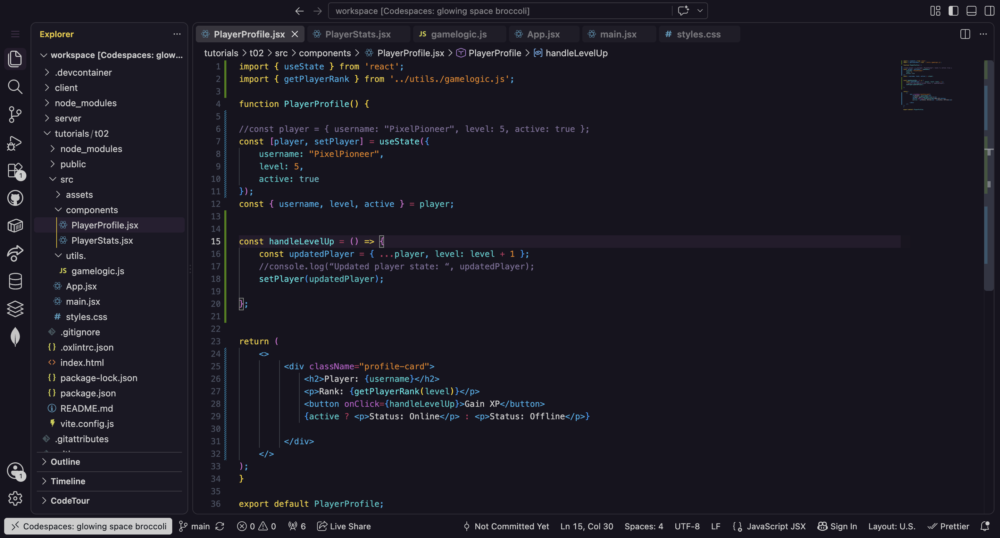
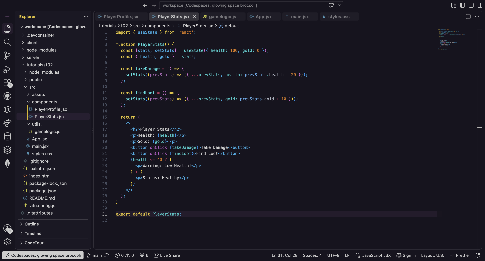
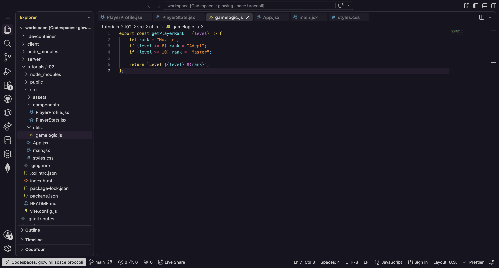
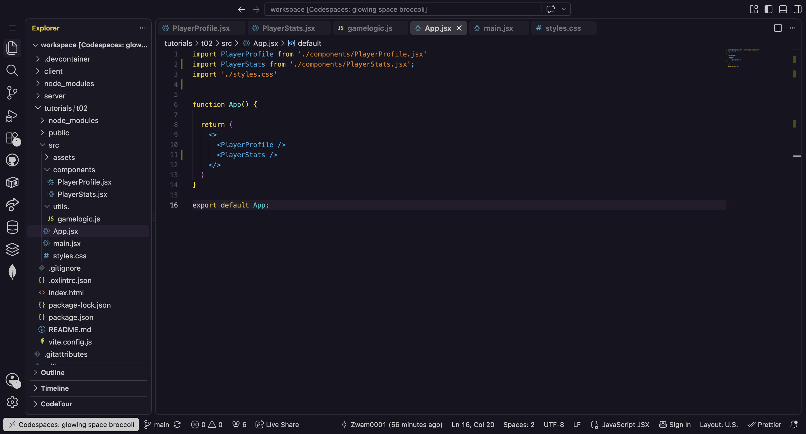
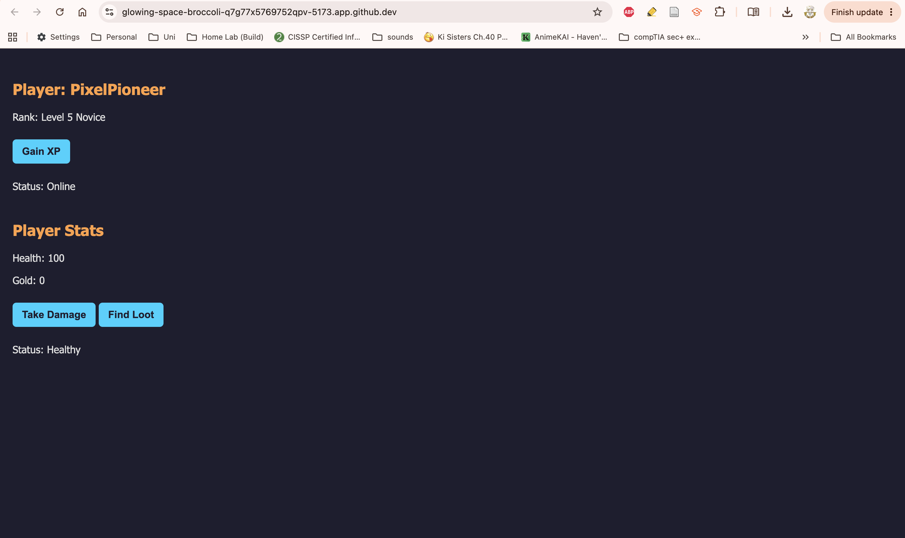

# Module 02 Devlog

## Proof of Completion
Provide a minimum of two screenshots OR one short GIF (under 10 seconds) demonstrating the completed work running in your Codespace.
<br><br>

#1


(PlayerProfile.jsx)
<br><br>
*Description: Created and defined a component that serves as a profile for the player. I defined an export statement to ensure that other components have access to this one. I then  defined a const JavaScript object, assigned it an object that represents the players properties (username, level, action) and hardcoded the data. Additionally, i used object destructuring to extract specific properties into distinct variables cleanly, added function + logic that handles level up action, imported gamelogic.jsx to get player rank, and added a return statement to send resulting values back to place where it was called.*
<br><br>

#2


(PlayerStats.jsx)
<br><br>
*Description: Added a new component that allows players to take damage and search for loot. Additionally, it tracks the players HP each time they take damage and accumulation of Gold each time they find loot. This component also spits out a health status according to how much HP each player has ('Warning: Low Health' or 'Status: Healthy'. *
<br><br>

#3


(gamelogic.js)
<br><br>
*Description: Created a standard JavaScript file and defined a function ```getPlayerRank``` which takes a level and categorises it under either master, adept, novice.*
<br><br>

#4


(App.jsx)
<br><br>
*Description: Edited App.jsx so that I could access the player profile from PlayerProfile.jsx, styles.css, and player stats from PlayerStats.jsx.*
<br><br>

#5


(main.jsx)
<br><br>
*Description: Edited main.jsx to import styles from styles.css, to apply global CSS configuration across my entire app.*
<br><br>

#6


(styles.css)
<br><br>
*Description: Edited style of app by defining own CSS.*
<br><br>

#7


(Output functionality 1)
<br><br>
*Description: This image depicts first functionality test of app.*
<br><br>

#8


(Output functionality 2)
<br><br>
*Description: This image depicts second functionality test of app*
<br><br>

#9


(Output functionality 3)
<br><br>
*Description: This image depicts third functionality test of app*
<br><br>

#10


(Version Control History)
<br><br>
*Description: All my commits and pull requests to Github (Saving my updates as I created and edited each file.)*
<br><br>

**Extension task completed successfully:** [Yes / No]
YES

<br><br>


## Concept Mapping

Identify the specific theoretical concepts from this week’s lectures that you applied to solve the practical work for this week.

**Concept 1: Creating a custom JSX component** *[Lecture slide number: 21]*
<br><br>
To create a custom JSX component you must define ***isolated*** (won't break part of application) ***reusable*** (can be placed on many different pages) interface elements ***pragmatically*** (through the application of coding logic and programming rules). 
<br><br>

**Implementation:**
<br><br>
Created 'PlayerProfile.jsx' file. All its logic and state (the ```player``` object managed by ```useState```, and ```handleLevelUp```) live entirely inside the function's own scope, so nothing outside can accidentally break it, and it doesn't depend on anything outside itself except the imported getPlayerRank helper. 'PlayerProfile.jsx' is exported (export default 'PlayerProfile.jsx') and takes the form of a self-contained function with no external data required to work, meaning it could be dropped onto multiple pages of the app and would render the same self-managed profile card each time.
    
*(Code snippet)*

```
import { useState } from 'react';
import { getPlayerRank } from '../utils./gamelogic.js';

function PlayerProfile() {

//const player = { username: "PixelPioneer", level: 5, active: true };
const [player, setPlayer] = useState({
    username: "PixelPioneer",
    level: 5,
    active: true
});
const { username, level, active } = player;

const handleLevelUp = () => {
    const updatedPlayer = { ...player, level: level + 1 };
    //console.log(“Updated player state: “, updatedPlayer);
    setPlayer(updatedPlayer);

};

return (
    <>
         <div className="profile-card">
             <h2>Player: {username}</h2>
             <p>Rank: {getPlayerRank(level)}</p>
             <button onClick={handleLevelUp}>Gain XP</button>
             {active ? <p>Status: Online</p> : <p>Status: Offline</p>}

         </div>
    </>
);
}

export default PlayerProfile;
```
<br><br>

- **Concept 2: Creating the React App** [Lecture slide number: 12]
<br><br>
To create a react app you've got to initialise a new React application, Navigate into the project directory, and start the local development server.
<br><br>

**Implementation:**
<br><br>
To initialise a new React application I had to navigate to my Codespaces terminal and use Vite as the scaffolding tool, which helped me create a complete React solution skeleton in a single command line instruction. To navigate into the project directory, in terminal I used ```cd``` to move to my desired directory and executed the ```npm install``` command to download all required packages and dependencies listed in my package.json. To start the local development server I changed back to my desired directory and ran the ```npm run dev``` command.
  
*(Code snippet)*

```
#Initialise 
npm create vite@latest tutorials/t02 -- --template react

#Navigate into project directory: 
cd tutorials/t02
npm install
npm run dev

#Start local development server: 
cd tutorials/t02
npm run dev
```
<br><br>


## AI Transparency and Critical Reflection

Detail how Generative AI was used during this lab.

**Table 1: AI Tool Usage Log**

| AI tool used    | Purpose                            | Prompt used                                           | Did you use the output "as is" or modify it? How?                        |
| :-------------- | :--------------------------------- | :---------------------------------------------------- | :----------------------------------------------------------------------- |
| *Claude* | *Create a new react component that manages an interactive game stat object using immutable state updates with the spread operator, and conditionally renders warning text based on the player's health.* | *https://claude.ai/share/9b260e71-50f5-405a-bb64-c396d0da52cd* | *Used output as is* |

<br><br>


## Analysis and Implications
In 2-3 sentences, reflect on the implications of AI assistance that you received this week. Consider academic integrity, security, or whether the AI obscured your understanding of the core concept.
<br><br>

**Reflection:**  
<br><br>
I think the AI somewhat obscured my ability to create my own custom jsx component, I think by making the AI write my PlayerStats.jsx file it prevented me from understanding the programming logic aspect of creating a custom jsx component. I don't think my programming and coding knowledge is deep enough and AI makes it worse since I'm not challenged to understand via application. Maybe next week I'll try not to rely on AI for programming and instead use it more so for composing the weekly reflections. 
