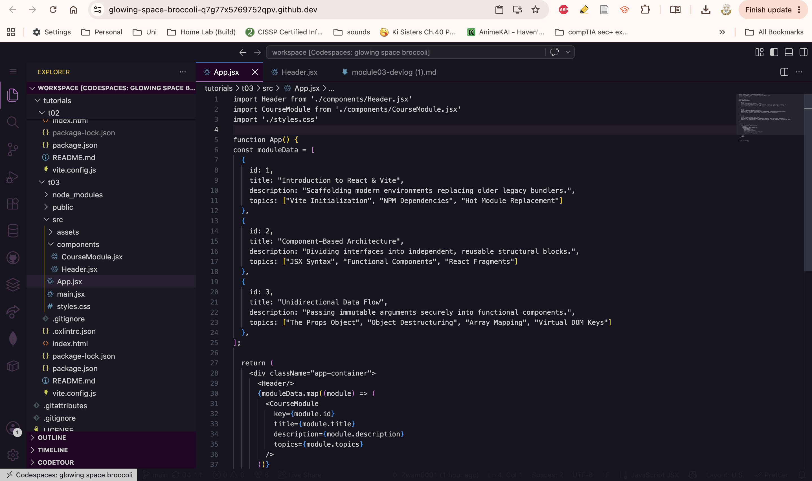
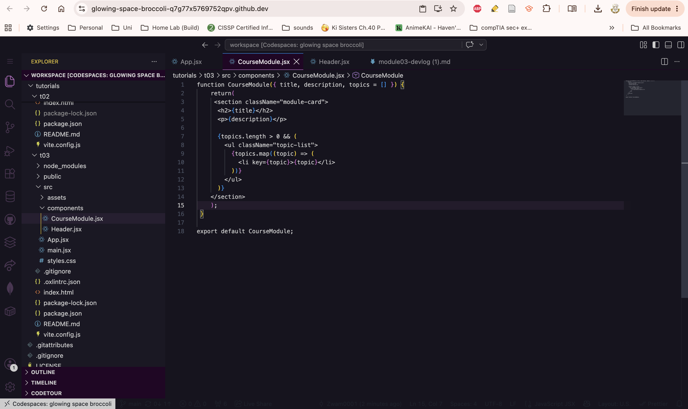
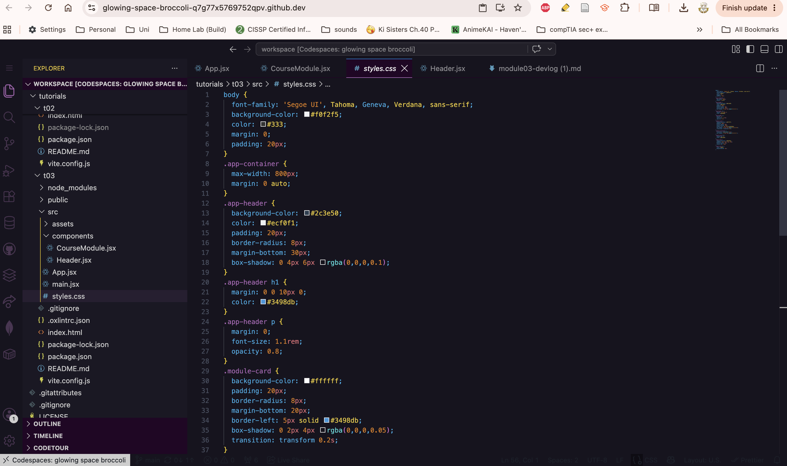
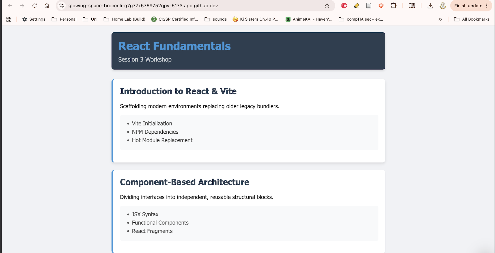

# Module 03 Devlog

## Proof of Completion
Provide a minimum of two screenshots OR one short GIF (under 10 seconds) demonstrating the completed work running in your Codespace.
<br><br>

#1
 

(Header.jsx)
<br><br>
*Description: Created a component 'Header'*
<br><br>

#2
 

(CourseModule.jsx)
<br><br>
*Description: Created a componet 'CourseModule' using the destructure process.*
<br><br>

#3
 

(App.jsx)
<br><br>
*Description: This image depicts App.jsx where I tranformed data array into a list of JSX elements using .map() to avoid hard coding data. I also endered the list by expanding the data structure to handle nested collections safely.*
<br><br>

#4
 

(Styles.css)
<br><br>
*Description: Edited style of app by defining own CSS.*
<br><br>

#5 
 
 

(Output)
<br><br>
*Description: This image depicts the final output of the app.*
<br><br>

**Extension task completed successfully:** [Yes / No]
YES

<br><br>
<br><br>

## Concept Mapping

Identify the specific theoretical concepts from this week’s lectures that you applied to solve the practical work for this week.

**Concept 1: Passing and using props** *[Lecture slide number: 25]* 
Props let a parent component send data down to a child component. the parent passes data and the child recieves all these props compiled into a single object.

<br><br>

**Implementation:** 
within this tutorial the paarent component is 'App.jsx' and it passes props to the child component 'CourseModule.jsx'. 'CourseModule.jsx' recieves the daa through object destructuring. 

*(Code snippet)*
App.jsx (Parent)
```
import Header from './components/Header.jsx'
import CourseModule from './components/CourseModule.jsx'
import './styles.css'

function App() {
const moduleData = [
  { 
    id: 1, 
    title: "Introduction to React & Vite", 
    description: "Scaffolding modern environments replacing older legacy bundlers.",
    topics: ["Vite Initialization", "NPM Dependencies", "Hot Module Replacement"]
  },
  { 
    id: 2, 
    title: "Component-Based Architecture", 
    description: "Dividing interfaces into independent, reusable structural blocks.", 
    topics: ["JSX Syntax", "Functional Components", "React Fragments"]
  },
  { 
    id: 3, 
    title: "Unidirectional Data Flow", 
    description: "Passing immutable arguments securely into functional components.",
    topics: ["The Props Object", "Object Destructuring", "Array Mapping", "Virtual DOM Keys"]
  },
];

  return (
    <div className="app-container">
      <Header/>
      {moduleData.map((module) => (
        <CourseModule
          key={module.id}
          title={module.title}
          description={module.description}
          topics={module.topics}
        />
      ))}
    </div>
  );
}

export default App
```
CourseModule.jsx (Child)
```
function CourseModule({ title, description, topics = [] }) { 
    return(
     <section className="module-card">
      <h2>{title}</h2>
      <p>{description}</p>

      {topics.length > 0 && (
        <ul className="topic-list">
          {topics.map((topic) => (
            <li key={topic}>{topic}</li>
          ))}
        </ul>
      )}
    </section>
    );
 }

export default CourseModule;
```
<br><br>

**Concept 2: Designing UI with component types** 
*[Lecture slide number: 20]* 
Data/state flows downward, form parent to child through props. Stateful parent owns the data that can change, using ```useState``` and the stateless child recieves data via props and displays it. The child component has no state of its own, it just shows whatever it is given. 

<br><br>

**Implementation:** 
Within the context of tut3, 'App.jsx' acts like the data owning parent as it holds module data and is responsible for managing it. 'CourseModule.jsx' is the stateless child that recives props ```(title, description, topics)``` and renders them. 

data flows down from App.jsx to CouseModule.jsx

*(Code snippet)*
App.jsx (Parent)
```
import Header from './components/Header.jsx'
import CourseModule from './components/CourseModule.jsx'
import './styles.css'

function App() {
const moduleData = [
  { 
    id: 1, 
    title: "Introduction to React & Vite", 
    description: "Scaffolding modern environments replacing older legacy bundlers.",
    topics: ["Vite Initialization", "NPM Dependencies", "Hot Module Replacement"]
  },
  { 
    id: 2, 
    title: "Component-Based Architecture", 
    description: "Dividing interfaces into independent, reusable structural blocks.", 
    topics: ["JSX Syntax", "Functional Components", "React Fragments"]
  },
  { 
    id: 3, 
    title: "Unidirectional Data Flow", 
    description: "Passing immutable arguments securely into functional components.",
    topics: ["The Props Object", "Object Destructuring", "Array Mapping", "Virtual DOM Keys"]
  },
];

  return (
    <div className="app-container">
      <Header/>
      {moduleData.map((module) => (
        <CourseModule
          key={module.id}
          title={module.title}
          description={module.description}
          topics={module.topics}
        />
      ))}
    </div>
  );
}

export default App
```
CourseModule.jsx (Child)
```
function CourseModule({ title, description, topics = [] }) { 
    return(
     <section className="module-card">
      <h2>{title}</h2>
      <p>{description}</p>

      {topics.length > 0 && (
        <ul className="topic-list">
          {topics.map((topic) => (
            <li key={topic}>{topic}</li>
          ))}
        </ul>
      )}
    </section>
    );
 }

export default CourseModule;
```

<br><br>
<br><br>


## AI Transparency and Critical Reflection

Detail how Generative AI was used during this lab.

**Table 1: AI Tool Usage Log**

| AI tool used    | Purpose                            | Prompt used                                           | Did you use the output "as is" or modify it? How?                        |
| :-------------- | :--------------------------------- | :---------------------------------------------------- | :----------------------------------------------------------------------- |
| *ChatGPT* | *Check for logic and syntax errors preventing code from working during task 3 (Error correction)* | *https://chatgpt.com/share/6a7bd540-e430-83ec-bce4-05a15216fc41* | *Used its explination to correct programming syntax and logic errors* |


<br><br>
<br><br>

## Analysis and Implications

In 2-3 sentences, reflect on the implications of AI assistance that you received this week. Consider academic integrity, security, or whether the AI obscured your understanding of the core concept.
<br><br>

**Reflection:**  
This week I used AI to help me correct a programming mistake I made, rather than telling it to just write the code for me. The explaination it gave me and the mistakes that it highlighted really helped me understand this weeks content.
