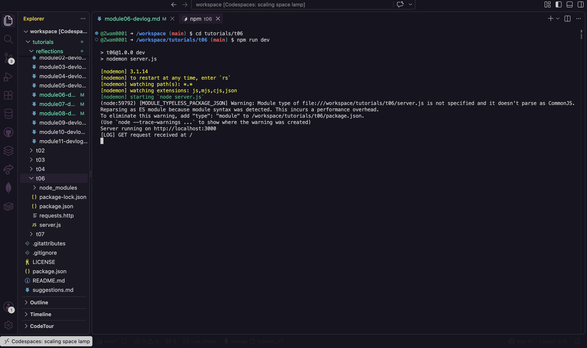
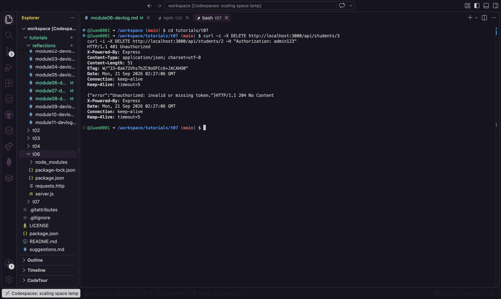
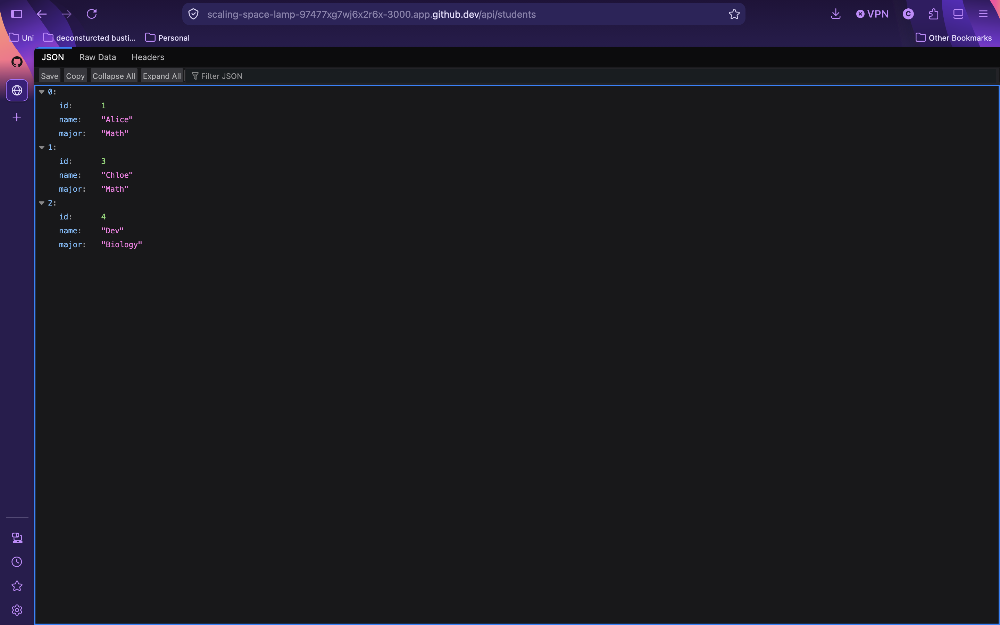
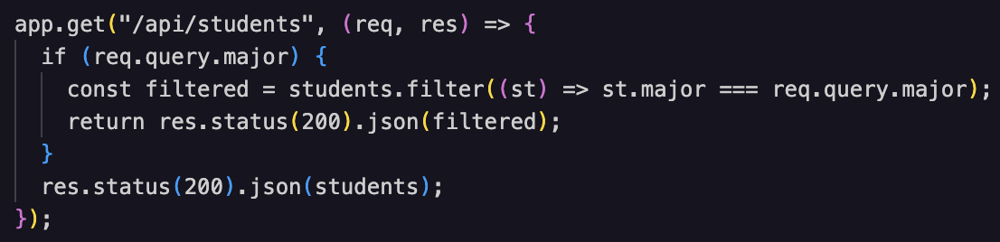

# Module 08 Devlog

## Proof of Completion
Provide a minimum of two screenshots OR one short GIF (under 10 seconds) demonstrating the completed work running in your Codespace.
<br><br>

#1
 
<br><br>
***Description:*** *starting server*
<br><br>

#2
 
<br><br>
***Description:*** *testing 401 and 204*
<br><br>

#3
 
<br><br>
***Description:*** *successful deletion of student 2*
<br><br>

**Extension task completed successfully:** [Yes / No]
YES

<br><br>
<br><br>

## Concept Mapping

Identify the specific theoretical concepts from this week’s lectures that you applied to solve the practical work for this week.
<br><br>

**Concept 1: Route-specific middleware (authentication gatekeeper)** *[Lecture slide number: 29]* 
<br><br>

**Implementation:** 
```checkAuth``` is a standalone middleware funtion. It compares the Authorisation header to the token and calls ```next()``` on a match. Otherwise it skips ```next()``` and returns a ```401```, so the delete handler never runs. It is injected into only the ```DELETE``` route, between the URL nad the handler, instead of being mounted globally. 
<br><br>


*(Code snippet)*
```
function checkAuth(req, res, next) {
  if (req.headers.authorization === "admin123") {
    return next();
  }
  // Intentionally skip next(): halt the pipeline here
  return res.status(401).json({ error: "Unauthorized: invalid or missing token." });
}

app.delete("/api/students/:id", checkAuth, (req, res) => {
  const targetId = parseInt(req.params.id);
  students = students.filter((st) => st.id !== targetId);
  res.status(204).send();
});
```
<br><br>

**Concept 2: Handling query strings in express** *[Lecture slide number: 24]* 
<br><br>

**Implementation:** 
The ```GET /api/students``` route reads the optional ```?major- ``` filter from ```req.query```. If it's present, the route returns only the matching students. If it's absent, it returns the full array. 
<br><br>


*(Code snippet)*
 


<br><br>


## AI Transparency and Critical Reflection

| AI tool used | Purpose                                | Prompt used                                                          | Did you use the output "as is" or modify it? How?                                        |
| :----------- | :------------------------------------- | :------------------------------------------------------------------- | :--------------------------------------------------------------------------------------- |
| Claude       | Troubleshoot an error in the terminal  | Why is my terminal outputting this message? (image of terminal)      | I used the output as is, by following the troubleshooting methods it provided.  
| Claude       | View json in browser | How do I view json in browser github codespaces?  | I used the output as is (had to have a back and forth with claude, because I wasn't specific enough to begin with), by following the troubleshooting methods it provided.  

<br><br>


## Analysis and Implications

In 2-3 sentences, reflect on the implications of AI assistance that you received this week. Consider academic integrity, security, or whether the AI obscured your understanding of the core concept.
<br><br>

**Reflection:**  
I didn't use too much AI this week, just used it to troubleshoot some terminal errors and to figure out how to view the json on browser, saved me so much time. I also found it a bit hard to use the browser vscode, as my codespace kept bugging. 
<br><br>

