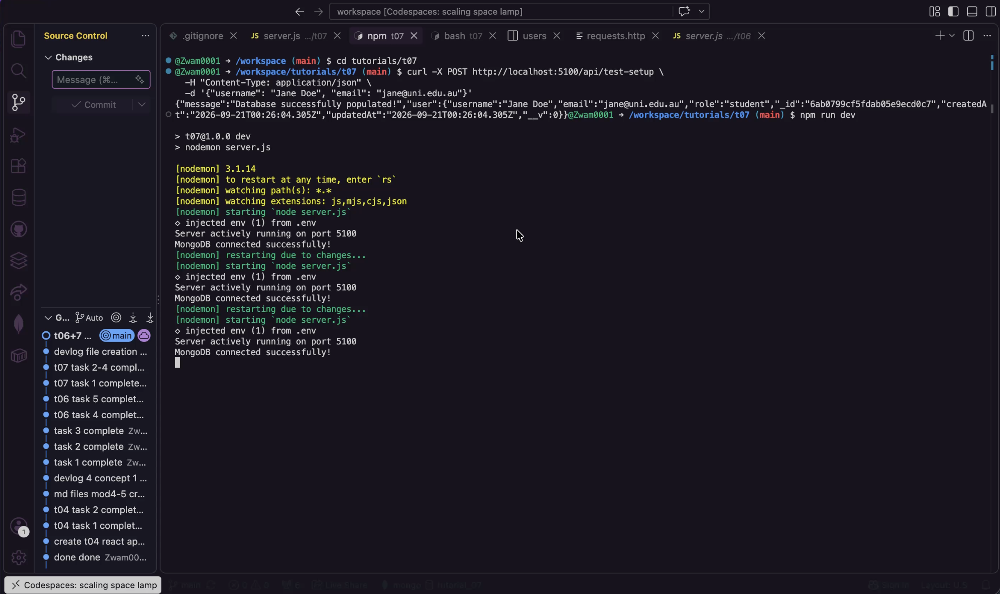
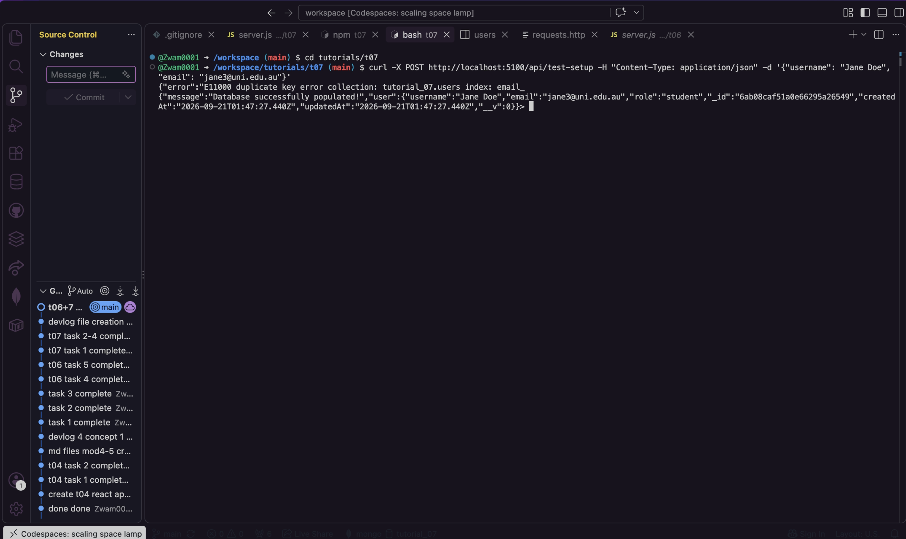
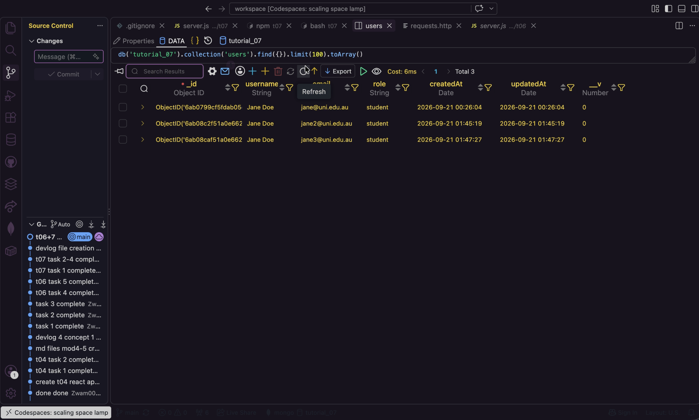

# Module 07 Devlog

## Proof of Completion
Provide a minimum of two screenshots OR one short GIF (under 10 seconds) demonstrating the completed work running in your Codespace.
  

#1
 
(1)
  
***Description:*** *checking for sucessful connection*
  

 
(2)
  
***Description:*** *adding a new element to table*
  

 
(3)
  
***Description:*** *sucessful propagation of new element*
  

**Extension task completed successfully:** [Yes / No]
YES

  

## Concept Mapping

Identify the specific theoretical concepts from this week’s lectures that you applied to solve the practical work for this week.

**Concept 1: Mongoose connection logic (async/await with try/catch)** *[Lecture slide number: 12]* 
  

**Implementation:** 
Connecting to MongoDB is an asynchronous network operation. connectDB waits for mongoose.connect() inside a try/catch. If the connection fails, it exits the process rather thatn leaving a running server with no database. 
  

*(Code snippet)*
 
  

**Concept 2: Schema validation with custom error messages, defaults and unique** *[Lecture slide number: 17]* 
  

**Implementation:** 
In models/user.js, the user schema used required: [true, "message"] to enforce mandatory fields with a readable error. It used unique: true to block duplicate emails and default to fill in role automatically. The duplicate-email E11000 error seen when re-sending the request came from unique: true 
  

*(Code snippet)*
 
  

## AI Transparency and Critical Reflection

Detail how Generative AI was used during this lab.

**Table 1: AI Tool Usage Log**

| AI tool used | Purpose                                | Prompt used                                                          | Did you use the output "as is" or modify it? How?                                        |
| :----------- | :------------------------------------- | :------------------------------------------------------------------- | :--------------------------------------------------------------------------------------- |
| Claude       | Troubleshoot an error in the terminal  | Why is my terminal outputting this message? (image of terminal)      | I used the output as is, by following the troubleshooting methods it provided.           |

  

## Analysis and Implications

In 2-3 sentences, reflect on the implications of AI assistance that you received this week. Consider academic integrity, security, or whether the AI obscured your understanding of the core concept.
  

**Reflection:**
I didn't use too much AI this week, just used it to troubleshoot some terminal errors, saved me so much time. I think this was one of the most complicated tutorials, as I kept making so many syntax erros in the terminal and getting connection errors. I also found it a bit hard to use the browser vscode, as my codespace kept bugging. 
  

